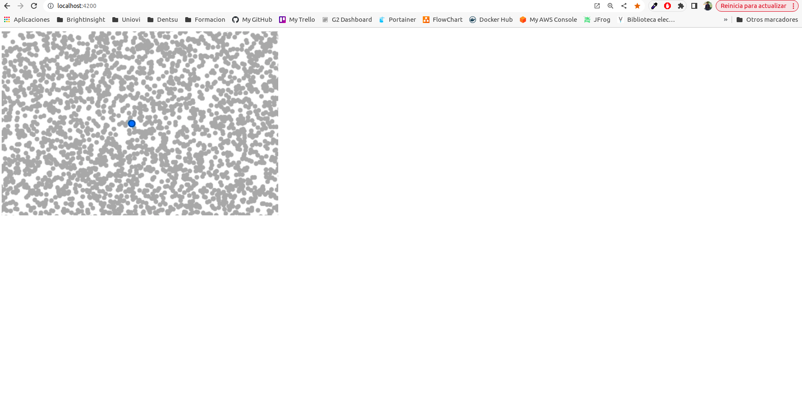

# Description

This project was generated with [Angular CLI](https://github.com/angular/angular-cli) version 14.2.7.

## Integrating steps

Install component in angular project

`
npm install regl-scatterplot --save
`

Install d3-scale types

`
npm install @types/d3-scale --save-dev
`

Clone the repo component

`
$ git clone https://github.com/flekschas/regl-scatterplot/tree/master
`

Compile the library

`
$ npm run build-library
`

Copy dist folder generated inside the component folder in your angular project with the last build prepared for typescript

`
cp ./dist $HOME/git/poc-regl-scatterplot-angular/node_modules/regl-scatterplot -R
`

Avoid comonjs warning in your angular project adding this line to your angular.json file inside build json tag:

`
"allowedCommonJsDependencies": [
    "regl"
]
`

Start your angular project

`
npm run start
`

Build your angular project

`
npm run build
`

